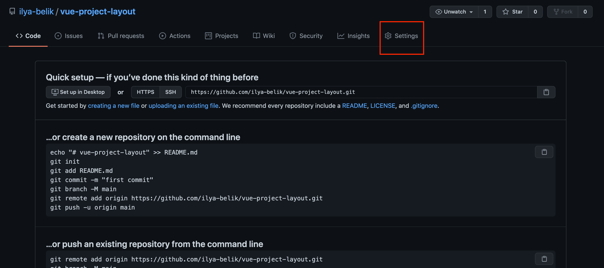
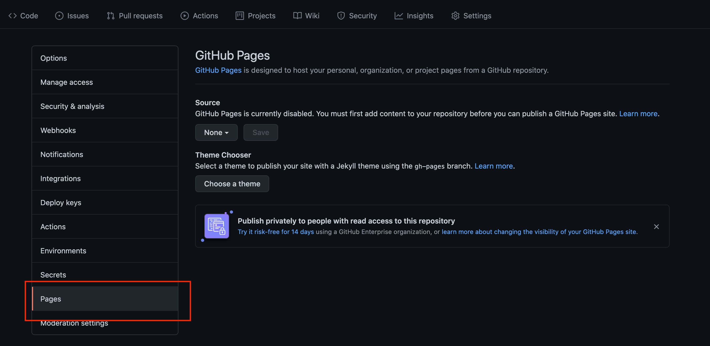
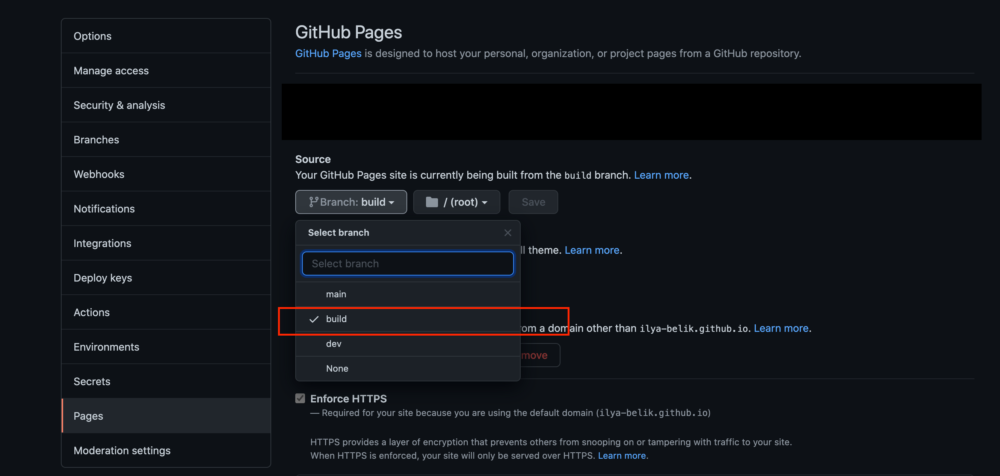
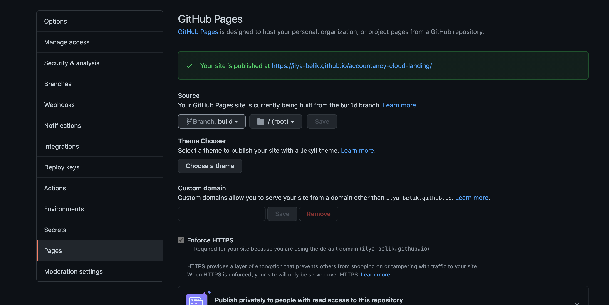

# ❇️ Шаблон для проекта на vue

## О проекте

- Подготовлено окружение для старта проекта

  1. Создана удобная структура `scss` файлов
  2. Перменные и миксины можно использовать по всему проекту

</br>

- Создана автосборка через `Github Actions` и публикация в отдельную ветку для `Github Pages`

</br>

- [Автоматизированы](#init-project):
  1. Инициализация `git`
  2. Создание нужных веток для начала разработки
  3. `Push` в удаленный репозиторий
  4. Установка пакетов

## Запуск

### `Локальный`

- **Клонировать репозиторий шаблона:**

```bash
git clone https://github.com/ilya-belik/vue-project-layout.git
```

<br />

- <a name="init-project">**Запускаем скрипт для инициализации проекта:**</a>

```bash
yarn init-project
```

Что делает скрипт:

- Удаляет информацию о репозитории проекта и коммитах `vue-project-layout`
- Удаляет папку с документацией
- Очищает `README.md`
- Инициализирует `git` c ветками `main`, `dev`, `build` и коммитом на выбор (по умолчанию -
  `"Init project"`)
- Инициализирует удаленный репозиторий `GitHub` (опционально)
- Пушит на `GitHub` (опционально)
- Ставит зависимости
- Удаляет сам себя

<br />

- **Запустить проект:**

```bash
yarn serve
```

<br />

- **Билдит локально так:**

```bash
yarn build
```

<br />

### `Github Pages` и `Github Actions`

- **Создать репозиторий на `Github`**
- **Создать в репозитории ветки `main` и `build`** Рекомендую создать ветку `dev` и заливать
  изменения в нее, а потом делать пул в main что бы не превысить бесплатный лимит github actions
  Если проект ининциализировлся скриптом с удаленным репозиторием - этот шаг можно пропустить
- **Перейти в раздел репозитория `Settings`** 
- **В настройках выбрать раздел `Pages`** 
- **В разделе `Source` выбрать ветку `build`** 
- **Если у вас появилось зеленое уведомление - все выполнено правильно**
  

---

## Особенности

- **Структура `SCSS`**

| Директория   | Назначение                                                                                 |
| ------------ | ------------------------------------------------------------------------------------------ |
| `base`       | включает глобальные стили, такие как сброс стилей, типография, цвета и т.д.                |
| `helpers`    | `глобальные миксины, функции, вспомогательные селекторы и т.д.`                            |
| `components` | содержит отдельные компоненты с отдельным файлом .scss для каждого из них.                 |
| `layout`     | `содержит стили для основных компонентов макета, таких как хедер, футер, навигация и т.д.` |
| `pages`      | содержит стили, специфичные для отдельных страниц, если это необходимо                     |
| `themes`     | стили для разных тем.                                                                      |
| `vendors`    | стили, миксины и прочее от третьих сторон                                                  |
| `main.scss`  | выходной файл, в котором объединяются все стили.                                           |

---

## Faq

**Как работает `Github Pages` и `Github Actions`**

При любом коммите в main вызывается `action`
[./github/workflows/build.yml](./github/workflows/build.yml)

Список файлов коммиты в которые `action` игнорирует:

- `.gitignore`
- `.prettierignore`
- `.gitattributes`
- `.prettierrc.json`
- `**.md`
- `**.lock`
- `init-project.sh`
